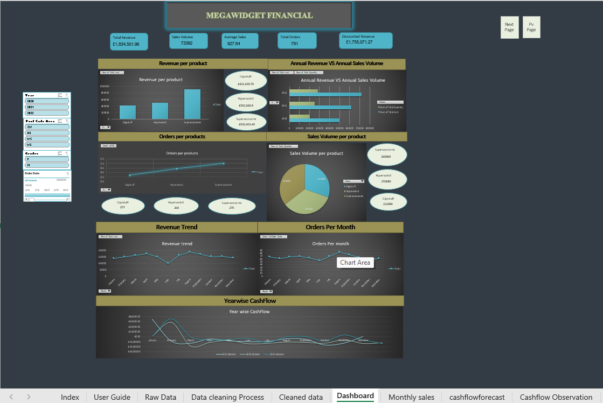
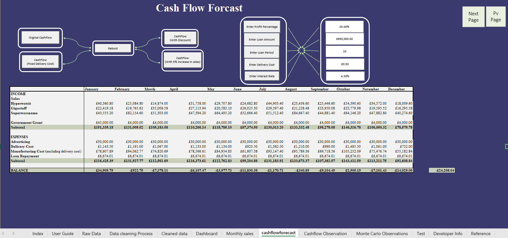

# Megawidget International — Financial Analysis & Dashboard

**Advanced Spreadsheets & Databases (BNM819) — Individual Coursework**  
Aston University | MSc Business Analytics | Student ID: 220241454

---

## Overview

A fully interactive Excel workbook built for **Megawidget International**, covering end-to-end financial analysis across three years (2020–2022). The workbook takes raw customer and sales data through a complete pipeline — data cleaning, pivot table analysis, a dynamic dashboard, cash flow forecasting, and Monte Carlo risk simulation — to support business decision-making for the company's three core products: **Hyperwotsit**, **Gigastuff**, and **Superwossname**.

---

## Workbook Structure

The workbook contains **29 sheets** organised into six functional layers:

| Layer | Sheets | Purpose |
|---|---|---|
| Navigation | `Index`, `User Guide` | Workbook contents and instructions |
| Data | `Raw Data`, `Data cleaning Process`, `Cleaned data` | Raw input → cleaned dataset |
| Analysis | `Lookup table`, `Sales`, `2022 sales`, `Monthly sales`, `Discounted revenue` | Sales and revenue calculations |
| Pivot Tables | `Orders per products`, `Sales Volume per product`, `Revenue per product`, `Annual Revenue VS Annual Sales`, `Revenue trend`, `Orders per month`, `KPI` | Summarised business metrics |
| Dashboard | `Dashboard`, `DData` | Interactive dynamic dashboard with slicers |
| Financial Modelling | `cashflowforecast`, `CF 2020`, `CF 2021`, `Monte Carlo Simulation`, `Monte Carlo Observations`, `Cashflow Observation` | Cash flow forecasts and risk analysis |

---

## Key Features

### 1. Data Cleaning
- Raw dataset: **5,104 rows** across 12 columns
- Cleaned dataset: **4,954 rows** across 21 columns
- Operations: duplicate removal, gender field standardisation via formula-based derivation, address parsing, postcode area extraction, and removal of incomplete records

### 2. Pivot Table Analysis
- Sales volume, revenue, and order counts broken down by product, month, year, and postcode area
- Cross-year comparison (2020, 2021, 2022) using multi-dimensional pivot tables with slicers

### 3. Dynamic Dashboard
- Fully interactive with **four slicers**: Year, Post Code Area, Gender, Order Date
- KPI tiles: Total Revenue, Sales Volume, Average Sales, Total Orders, Discounted Revenue
- Six charts: Revenue per Product, Annual Revenue vs Sales Volume, Orders per Product, Sales Volume per Product (pie), Revenue Trend (line), Orders per Month (line), Year-wise Cash Flow (multi-line)

### 4. Cash Flow Forecast (2022)
- 12-month forecast for all three products plus Government Grant income
- Expenses: Advertising, Delivery Cost, Manufacturing Cost, Loan Repayment
- Loan: **£650,000** at **4.3% interest** over **10 years** (monthly repayment: £6,674.01)
- Parametric inputs fully recalculate on change; historical CFs for 2020 and 2021 included

### 5. Monte Carlo Simulation
- **1,000 simulation runs** per month using normally distributed random sampling
- Annual probability of profit: **47.9%** | Best month: **January (59.8%)**

---

## Dashboard

### Full View — All Years, All Regions, All Genders

> **KPIs (all years):** Total Revenue £1,834,501.96 | Sales Volume 73,382 | Avg Sales £927.84 | Total Orders 791 | Discounted Revenue £1,755,071.27

---

### Filtered View — 2022, Male Customers Only

> **KPIs (2022, Males):** Total Revenue £383,655.54 | Sales Volume 14,898 | Avg Sales £1,071.84 | Total Orders 139 | Discounted Revenue £365,814.12

The slicers on the left panel filter by **Year**, **Post Code Area** (CW/HS/WC/WS), **Gender**, and **Order Date** — all charts update simultaneously.

---

## Monthly Sales Pivot Table (2020–2022)

Three-year pivot showing monthly sales volume by product and postcode area with annual totals and grand totals across all years.

---

## Cash Flow Forecast — 2022

The forecast sheet includes a flow diagram showing how each model variant (Original, With Discount, With 5% Sales Increase, Fixed Delivery Cost) feeds into the parametric model. Parameters entered once propagate across all calculations.

**Annual Net Balance (2022): -£24,208.04**

| Month | Balance | | Month | Balance |
|---|---|---|---|---|
| January | +£34,909.79 | | July | -£1,170.71 |
| February | -£922.75 | | August | -£340.89 |
| March | -£7,378.11 | | September | -£9,104.49 |
| April | -£6,107.47 | | October | +£2,905.19 |
| May | -£3,977.73 | | November | -£7,161.43 |
| June | -£11,830.38 | | December | -£14,029.06 |

---

## Monte Carlo Simulation — Risk Analysis

1,000 simulations per month sampling income and expenses from normal distributions fitted to historical data. Results include probability of profit, min/max range, mean, and standard deviation.

### January – April

### May – September

### October – December

### Simulation Summary

| Period | Prob. of Profit | Min | Max | Mean | Std Dev |
|---|---|---|---|---|---|
| **Full Year 2022** | **47.9%** | -£503,840 | +£452,071 | -£9,218 | £146,932 |
| January | 59.8% | -£106,676 | +£132,735 | +£8,933 | £35,190 |
| February | 51.7% | -£151,234 | +£153,584 | +£517 | £52,408 |
| March | 46.2% | -£178,706 | +£106,134 | -£3,194 | £40,035 |
| April | 45.4% | -£134,753 | +£121,118 | -£3,545 | £40,248 |
| May | 52.4% | -£150,507 | +£142,732 | -£968 | £46,937 |
| June | 48.2% | -£128,003 | +£82,749 | -£1,513 | £30,057 |
| July | 48.3% | -£148,190 | +£147,688 | -£1,403 | £46,787 |
| August | 53.3% | -£183,221 | +£183,574 | +£2,237 | £56,934 |
| September | 47.8% | -£107,879 | +£109,633 | -£1,849 | £34,798 |
| October | 50.0% | -£151,973 | +£162,322 | +£341 | £56,078 |
| November | 46.7% | -£122,847 | +£105,458 | -£2,253 | £38,182 |
| December | 45.1% | -£102,117 | +£97,720 | -£4,219 | £30,928 |

> **Key insight:** January is the strongest month (59.8% probability of profit). Most months hover between 46–53%, reflecting high variability in manufacturing and sales costs relative to revenue. Only January and August show a positive mean balance.

---

## Products & Pricing

| Code | Product | Unit Cost | Case Size |
|---|---|---|---|
| B | Hyperwotsit | £2.01 | 20 |
| D | Gigastuff | £1.89 | 18 |
| E | Superwossname | £3.49 | 20 |

---

## How to Use

1. Open `Spreadsheet_Coursework_220241454.xlsm` and **enable macros** when prompted
2. Start at the **Index** sheet for navigation
3. Read the **User Guide** sheet for full instructions
4. On the **Dashboard**, use the four slicers to filter all charts simultaneously
5. On **cashflowforecast**, update the five input cells (Profit %, Loan Amount, Loan Period, Delivery Cost, Interest Rate) to model different scenarios
6. On **Monte Carlo Simulation**, press `F9` to trigger a fresh set of 1,000 simulations

---

## Technical Highlights

- **VBA macros** for Next/Previous page navigation buttons across all sheets
- **VLOOKUP** against a lookup table for product names, costs, and case sizes
- **Dynamic named ranges** feeding pivot charts on the dashboard
- **Slicers** connected to multiple pivot tables simultaneously for cross-filtering
- **Monte Carlo** implemented with `NORM.INV(RAND(), mean, std_dev)` — recalculates on `F9`
- **Loan repayment** using the `PMT` function: `=PMT(rate/12, period*12, -principal)`
- Four cash flow variants modelled: Original, With Discount, With 5% Sales Increase, Fixed Delivery Cost

---

## Requirements

- **Microsoft Excel 2016 or later** — `.xlsm` format requires macro support
- Enable macros on open (required for navigation and VBA features)
- Do **not** open in LibreOffice or Google Sheets — VBA macros and pivot slicers will not work correctly
